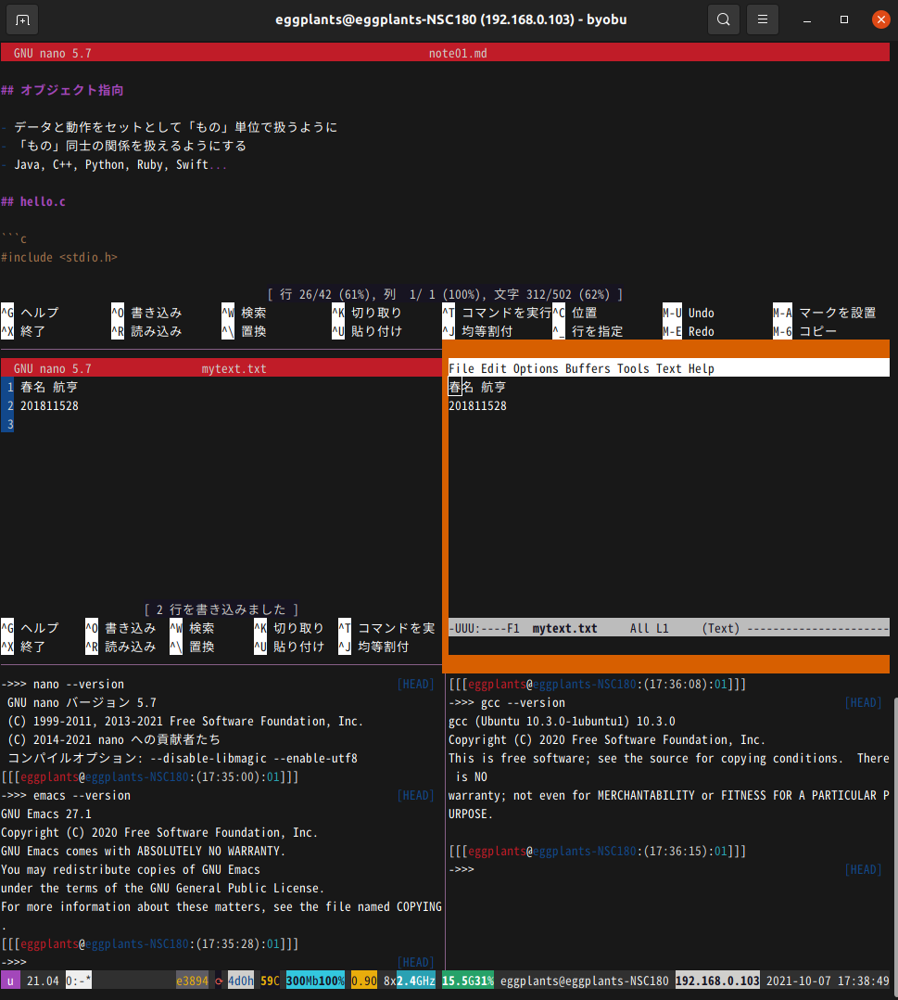

<!-- markdownlint-disable MD024 -->

# ソフトウェア工学 第1回 レポート課題

- 学生番号: 201811528
- 氏名: 春名航亨

## 【授業内課題の確認】

### 【授業内課題1】「-o」オプションをつけずに実行すると何が起きたか試してみよう

実行ファイルa.outが作成された。

### 【授業内課題2】ソースコード中の「Hello!World」の文字列を好きな文字列に置き換えて実行し、実際の実行結果のスクリーンショットを取ろう


### 【授業内課題3】char型の変数を「%d」で表示してみたり、わざと間違えてみて、何が起こったか確認しよう

`'a'`を`printf("%c")`で表示した際、`97`と出力された。これは`'a'`の文字コードである。

### 【授業内課題4】それぞれの変数に好きな算術計算を適用して、結果を確認しよう。具体的には、整数を割り算で割り切れない数にしてみたり、文字列の数値を足してみよう

`j /= 0;`として0除算を行っても、`warning: division by zero`が出るだけで、`printf("j = %f\n", j);`を実行した際は`inf`となっていた。
また`’a’ + ‘b’`としたら、それぞれのコードポイントを加算した`195`が出力された(97+98)。しかし、`char c = ‘a’;`に対して`c += ‘b’;`を行うと`-61`が出力された。
(なぜ？)

### 【授業内課題5】「0から始まって9で終わるループ」を「9から始まって0で終わる」ループに書き換えて、ソースコードをレポートに貼ろう

```clang:rev_loop.c
main(i){for(;i++<11;)printf("%d\n",11-i);}
```


## 【調べもの】

> ソフトウェア工学では、「ソフトウェア開発モデル」と呼ばれる、ソフトウェアを開発する際のプロセスそのものをモデル化した物を扱います。例として「ウォーターフォールモデル」などが有名です。

### １． 5個以上のソフトウェア開発モデルを調べ、名前を列挙してください

1. ウォータフォールモデル
2. プロトタイプモデル
3. スパイラルモデル
4. RAD
5. ソフトウェアプロダクトライン

### ２．列挙したモデルのうち、自分が気になった1つについて詳しく調べ、概要と特徴を300字程度で説明してください

RADとは「Rapid Application Development」の略であり、ユーザを含めた少人数のチームでの仕様分析・設計・開発を行い、繰り返し試作品を作成して評価・改良を繰り返す開発手法である。[1]
設計のバリデーション、ドキュメントやプログラムの自動生成を行うCASEツールや、ビジュアルプログラミング言語などの開発支援ツールを用いて開発を高速化させることもある。[1]
長所としては、短期間かつ低コストでシステムを開発することができ、またプロトタイピングを作成してユーザと対話することで高品質のシステムが見込めることが挙げられる。一方で短所として、スケーラビリティの低下や設計不足、柔軟性を欠いたシステムとなってしまう可能性があることが挙げられる。[2]

[1]: https://www.otsuka-shokai.co.jp/words/rad.html
[2]: https://en.wikipedia.org/wiki/Rapid_application_development#Pros_and_cons_of_rapid_application_development

## 【環境構築の確認】

> 日本語化されたVSCode上で、自分の氏名と学籍番号からなる「mytext.txt」が開かれている様子のスクリーンショットを貼ってください。何らかの理由で、どうしてもVSCode + GCC以外の環境を使いたい人は、その旨を書いたうえで、現在のエディタとコンパイラが分かるようにスクリーンショットを貼ってください。

宗教上の理由から、GNU nano v5.7+GNU Emacs 27.1+gcc 10.3.0を利用しています。



## 【C言語の基礎１ 画面出力とキーボード入力】

> 画面に「Please input price: 」と表示したのち、キーボードから数字を受け取り、それを1.08倍して「The total price is 【1.08倍した数値】 yen (reduced tax rate)」と表示するプログラムを作り、コンパイルして実行してください。ソースコードと、キーボードから自分の学籍番号を入力した場合の実行結果のスクリーンショットを貼ってください。

### ソースコード

```c
main(){
  float price;
  printf("Please input price: ");
  scanf("%f", &price);
  price *= 1.08;
  printf("The total price is %.0f yen (reduced tax rate)\n", price);
}
```

### 実行結果のスクリーンショット


## 【C言語の基礎2 for文による繰り返し】

> 画面に「Please input number:」と表示し、キーボードから整数値を受け取り、その値の階乗を画面に出力するプログラムを作成し、ソースコードと実行結果のスクリーンショットを貼ってください。ただし、プログラムは、再帰やwhileループを使わずに、for文を使って作成してください。出力結果には、3の階乗、5の階乗、15の階乗を含めてください。

### ソースコード

```c
#include <stdio.h>

int fact(int n) {
  if (n < 0) {
    fprintf(stderr, "Error: n must be positive\n");
    exit(1);
  }
  if (n == 0) return 1;
  int res = 1;
  for (; n > 0; n--) res *= n;
  return res;
}

main() {
  int n;
  printf("Please input number: ");
  scanf("%d", &n);
  printf("%d\n", fact(n));
}
```

### 実行結果のスクリーンショット


### おまけ（解かなくてもいい）

> 作製したプログラムに様々な数値を入力してみて、計算結果を確認し、気付いたことがあったら、何が起こったかと、推定される原因を書いてください。

入力が0や負数であった場合に対応するためには単純にforループを回す前に入力を確認する必要がある。
また`scanf("%d", &n);`に対して小数点を含む入力(0.1とか)を与えた場合は整数部のみが取られる。しかし整数部を省略した場合(.111とか)異常な値になる(.111->11967936)。
(なぜ)

## 【while文による無限ループとif文による脱出】

> 実行すると、「Press s to stop:」と表示され、キーボードで「s」以外の文字を入力するとその入力は無視して「Press s to stop:」と表示し、「s」が入力されたら終了するプログラムのソースコードと、実行結果を書いてください。

### ソースコード

```c
main() {
  char c;
  while (c != 's') {
    puts("Press `s' to stop: ");
    scanf("%c", &c);
  }
}
```

### 実行結果のスクリーンショット


### おまけ（解かなくてもいい）

> 教わった通りに素直に実装すると、キーボードから1文字読み取る際に「a」→エンターキーと入力した際に、2回「Press s to stop:」が表示されてしまいます。同様に、「aaa」→エンターキーのように複数文字入力した場合も、意図しない挙動になります。C言語の標準入力における「バッファ」について自力で調べ、この問題を解決してみてください。

そもそもncurseにある`getch`関数で1文字ごとにEnterなしに受け取れば良い。こうすることで複数文字を受け取ってしまうこともなく、2回プロンプトが表示されたりもしない。
以下のコードでは`getch`の実装をそのまま貼っているが、`ncurse.h`をincludeして用いても良い。(環境に依存するのであまり好みではない)

```c
#include <termios.h>
#include <unistd.h>
// https://stackoverflow.com/a/23035044/12021810
int getch() {
  struct termios oldattr, newattr;
  int ch;
  tcgetattr(STDIN_FILENO, &oldattr);
  newattr = oldattr;
  newattr.c_lflag &= ~(ICANON | ECHO);
  tcsetattr(STDIN_FILENO, TCSANOW, &newattr);
  ch = getchar();
  tcsetattr(STDIN_FILENO, TCSANOW, &oldattr);
  return ch;
}
main() {
  int c;
  while (c != 's') {
    puts("Press `s' to stop:");
    c = getch();
    printf("%c\n", c);
  }
}
```


## 【感想や要望】

以前にかじったC言語の良い復習となった。
要望としては、以下２つの挙動について解説をお願いしたい。

- `scanf("%d", &n);`に対して整数部を省略した数字を入力した場合異常な値になる(.111→11967936)
- `printf(“%d\n”, ’a’ + ‘b’)`としたら、それぞれのコードポイントを加算した`195`が出力されるが、`char c = ‘a’;`に対して`c += ‘b’;`を行うと`-61`が出力される。
