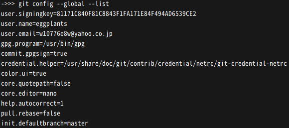
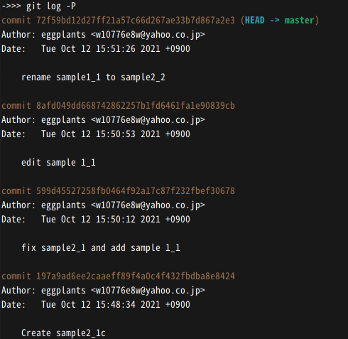
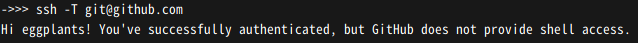
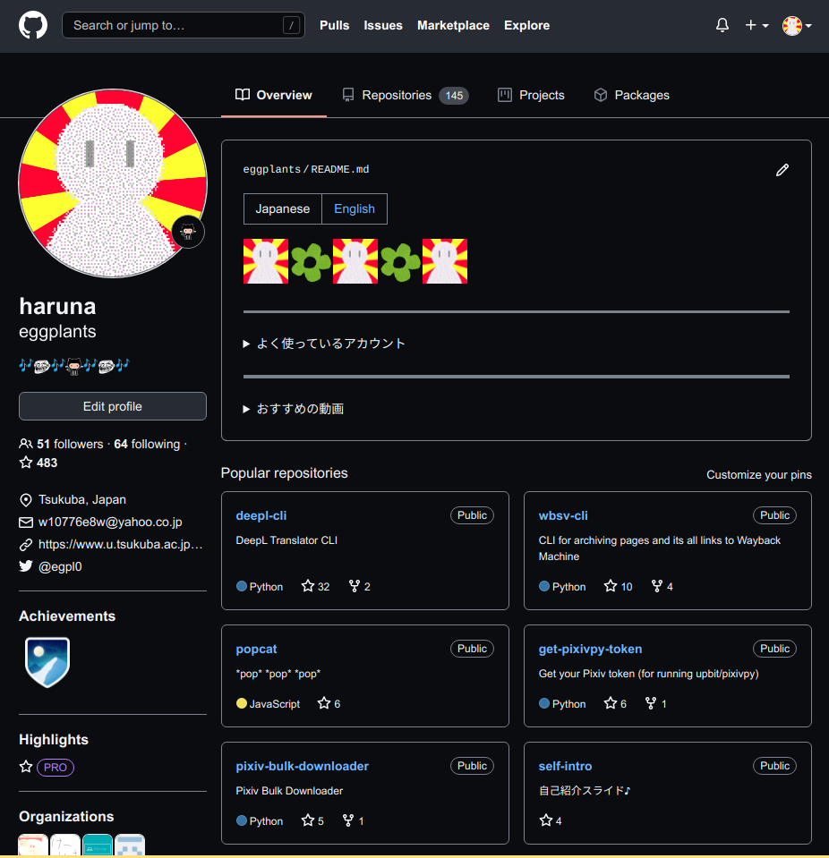
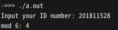
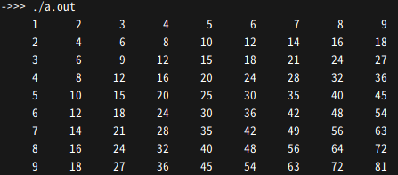
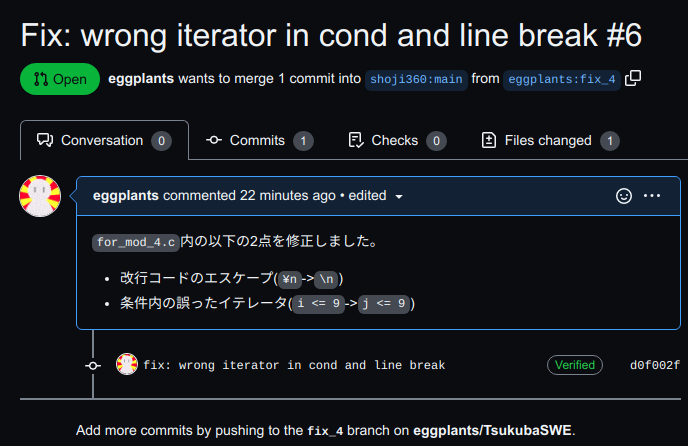

<!-- markdownlint-disable MD024 -->

# ソフトウェア工学 第2回 レポート課題

- 学生番号: 201811528
- 氏名: 春名航亨

## 【授業内課題の確認】

### 【授業内課題1: Gitインストールの確認】

> GitBash内で「`git config --global --list`」コマンドを実行した結果のスクリーンショットを貼ってください。



### 【授業内課題2: ログの確認】

> この時点で「`git log -P`」コマンドを打って表示されたログのスクリーンショットを貼ってください。長すぎて画面に入りきらない場合は、末尾から移っている部分だけで構いません。



### 【授業内課題3: SSHキー登録の確認】

> GitHubにSSH鍵で接続できたことを示す「ssh -T git@github.com」の結果を貼ってください



### 【授業内課題4: GitHubトップページの確認】

> 今回の授業の内容をpushした後で、GitHubの個人のトップページである 「 `https://github.com/【あなたのID】` 」のページ全体のスクリーンショットを貼ってください。



## 【調べもの1】

> SSHや、今回のGitHubへの接続では、公開鍵と秘密鍵をペアとして用いる認証形式を使っています。公開鍵暗号方式およびRSAについて軽く調べて、その内容をまとめてください。

### 1. SSHで使われる公開鍵認証方式について、その仕組みを300文字程度で簡潔に説明してください

`ssh-keygen`などでホスト側で生成した公開鍵と秘密鍵を作成する。そしてリモートサーバに対して公開鍵を転送する。こうすることで、ホスト側からsshによってリモートサーバにログインする際に、リモートサーバ側が事前に交換された公開鍵を使ってホスト側の秘密鍵の真正性を確認して信頼できる通信相手かどうか認証を行う。このような仕組みで、信頼できない第三者がリモートサーバへログインすることを防ぐことが出来る。ただし、秘密鍵が流出した場合はその限りではないので、秘密鍵にパスフレーズを設定したり、sshの際、公開鍵認証と合わせてパスワードを要求するなどの対策も有効である。

### 2. 今回GitHub上に配置したのは公開鍵・秘密鍵のどちらか、なぜそうしたかを簡潔に書いてください

GitHubに置いたのは、公開鍵である。なぜなら、ローカルにある秘密鍵を用いてGitHubにログインする際に、GitHub側は公開鍵を用いて真正性を確認するため、秘密鍵は必要ではないから。

## 【調べもの2】

> 個別バージョン管理システム、集中型バージョン管理システム、分散型バージョンシステムについて、それぞれの具体的なソフト名を調べて列挙してください。

### 個別バージョン管理システム

1. Revision Control System (RCS)
2. Source Code Control System (SCCS)

### 集中型バージョン管理システム

1. Subversion (SVN)
2. Concurrent Version System (CVS)

### 分散型バージョンシステム

1. Git
2. Mercurial

## 【Gitによるファイル管理】

> プロジェクトフォルダ内に「report2」というフォルダを作成し、これまでに作成したすべてのsample1_x.cのファイルをコピーし、一括でインデクスに追加して、コミットしているところのスクリーンショットを貼ってください。

## 【C言語の復習】

> 実行すると「Input your ID number」と聞いてきて、整数値を入力してエンターキーを押すと、その値を6で割った余りを計算し、計算結果を「Your problem number is 【実際の数値】」と出力するプログラムを作成してください。

### ソースコード

```c
main() {
  int id;
  printf("Input your ID number: ");
  scanf("%d", &id);
  id %= 6;
  printf("mod 6: %d\n", id);
}
```

### 実行結果のスクリーンショット



## 【プルリクエストによる実際のソースコードの修正】

> 以下のリポジトリに、「for_mod_0.c」から「for_mod_6.c」まで、C言語として間違っており動かないソースコードが7つ公開されています。
>
> <https://github.com/shoji360/TsukubaSWE>
>
> GitHubの「プルリクエスト」機能を使って、このうち1つのファイルを、正しく動くように修正してください。
> この時、ひとつ前の課題の回答を利用して、学生番号を6で割った余りが0だった人は「for_mod_0.c」を、余りが1だった人は「for_mod_1.c」を、というように修正するファイルを決定してください。
>
> ファイル名、ソースコード、実行画面、プルリクエスト投稿完了画面のスクリーンショットをそれぞれ貼ってください。
>
> できる人は、プルリクエストの練習にもなりますので、複数のファイルを修正しても構いません。
>
> 今回のメインの課題ですが、環境などによってどうしても解けない場合があります。本課題は成績には影響しますが、解けなかったことによって落第するということはないようにします。

### 修正したファイル名

`for_mod_4.c`

### 実行結果のスクリーンショット



### プルリクが正しく投稿された画面のスクリーンショット



## 【感想や要望】

特にありません。