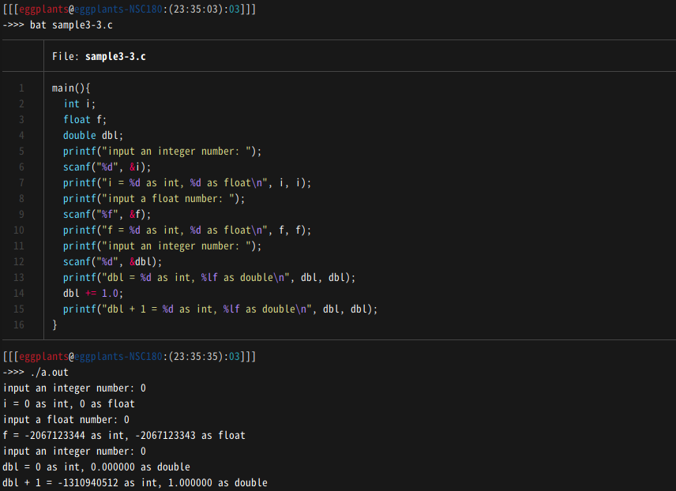
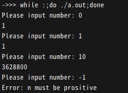
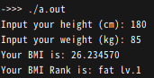
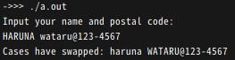
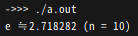

<!-- markdownlint-disable MD024 -->

# ソフトウェア工学 第3回 レポート課題

- 学生番号: 201811528
- 氏名: 春名航亨

## 【授業内課題の確認】

### 【授業内課題１：フォーマット指定子の確認】

#### 実際の実行結果



#### 考察

`scanf("%d", &i)`に`1.0`を入力した場合`i = 1 as int, 1 as float`となったが、反対に`scanf("%f", &f)`に`1`を入力した場合は`f = -604461248 as int, -604461247 as float`と、意図しない数が代入された。
また`scanf("%d", &dbl);`に`0`を入力した場合`dbl = 0 as int, 0.000000 as double`が出力されたが、`dbl += 1`とdoubleにintを加算した後`dbl + 1 = -516537696 as int, 1.000000 as double`と、doubleを`%d`で表示した際に異常な値が出力された。
printfフォーマット文字列と変数の型は一致させないと異常な値となる場合がある。

### 【授業内課題２：for文のwhile文への書き換え】

#### ソースコード

```c
#include <stdio.h>

int fact(int n) {
  if (n < 0) {
    fprintf(stderr, "Error: n must be prositive\n");
    exit(1);
  }
  if (n == 0) return 1;
  int res = 1;
  for (; n > 0; n--) res *= n;
  return res;
}

main() {
  int n;
  printf("Please input number: ");
  scanf("%d", &n);
  printf("%d\n", fact(n));
}
```

#### 出力結果



### 【授業内課題３：BMIを計算する関数を作る】

#### ソースコード

```c
float bmi(float, float);
const char* rank_bmi(float);

float bmi(float height, float weight) {
  return weight / ((height / 100) * (height / 100));
}

const char* rank_bmi(float bmi) {
  if (bmi < 18.5) {
    return "slim";
  } else if (bmi < 25) {
    return "usual";
  } else if (bmi < 30) {
    return "fat lv.1";
  } else if (bmi < 35) {
    return "fat lv.2";
  } else if (bmi < 40) {
    return "fat lv.3";
  } else {
    return "fat lv.4";
  }
}

main() {
  float h, w, res;
  printf("Input your height (cm): ");
  scanf("%f", &h);
  printf("Input your weight (kg): ");
  scanf("%f", &w);
  res = bmi(h, w);
  printf("Your BMI is: %f\n", bmi(h, w));
  printf("Your BMI Rank is: %s\n", rank_bmi(res));
}
```

#### 出力結果



## 【調べものというか、感想】

> 変数や配列、文字列や関数などを扱ううえで、C言語は現代的な言語と比べてかなり原始的なので、大分使いづらいと思います。実際に今まで使ってきた言語と比較して、わかりづらい部分や、面倒な部分を書きだして、紹介してください。

Rubyなどでも言えるが、`include`した際、何の定数や関数が宣言されたのかわからない。気をつけないと定数や関数を無意識のうちに上書きしてしまいそうで怖い。

Rubyの組み込みメソッドは、破壊的なものには慣例的に末尾に`!`をつけるが、C言語はそうでないことがほとんどなので気をつける。

配列の名前が先頭のアドレス、すなわちポインタ変数となっていることに気が付かず(`arr`=`&arr[0]`)、関数に配列を渡す際には`char *var`が引数の型となることに最初は納得がいかなかった。

`stdbool`を用いない場合、true/falseが0/1としか表現できない点では、awkのようにシンプルでいいなと思った。しかし時として意図しない挙動を生む可能性があるので注意すべき。

Cは、現代の複雑な型が最初から利用できる言語よりはプリミティブな型しかないので不便。

動的型付けの言語と違って、型の下限や上限に達した時に型が自動的に切り替わったりしないので、バッファオーバーフローに気をつける必要がある。

Javaもそうだが、意図しない暗黙的な型変換によって予期せぬ結果を生む場合がある。

### 【レポート課題１：文字を操作する関数】

> 文字を1つ受け取ると、それが大文字だった場合は小文字に、小文字だった場合は大文字にして返す関数「char swap_case()」を実装してください。大文字でも小文字でもない文字が入力された場合は、そのまま返すようにしてください。
>メイン関数からこの関数を呼び出し、【苗字を大文字にしたアルファベットの自分の氏名@郵便番号】を与えた際の実行結果を貼ってください。
>メイン関数内の呼び出し部分は、サンプルコードを参考にして構いません。

#### ソースコード

```c
char swap_case(char c) {
  if (64 < c && c < 91) {
    c += 32;
  } else if (96 < c && c < 123) {
    c -= 32;
  }
  return c;
}

main() {
  puts("Input your name and postal code:");
  char s[50];
  scanf("%50[^\n]", &s);
  int i = 0;
  char cc;
  while (s[i] != '\0') {
    cc = swap_case(s[i]);
    s[i++] = cc;
  }
  printf("Cases have swapped: %s\n", s);
}
```

#### 出力結果



### 【レポート課題２：数式で表されるアルゴリズムの実装】

> 自然対数の底（ネイピア数）を求めるプログラムを作成せよ。ただしwhile文を使用すること。
> なお、0!は1である。ループは10回まわす程度で比較的良い値が得られる。階乗は急激に大きくなるため、あまりまわし過ぎると分数の値（1/n!）が小さくなりすぎ、精度の限界を超えてしまい、値が求められなくなる。ネイピア数の実際の値は各自調べ、正しい値が求められていることを確認すること。注意する点として、プログラミング言語の多くではaとbが整数の時、a/bを整数の割り算と解釈してしまう。たとえば9/2の結果として4（そして余りが1）を返す。それを避けるためには1.0*a/bというようにするとよい。今回の場合、階乗がfactに入っているとして、1/factでなく1.0/factと書くとよい。

#### ソースコード

```c
int fact(int n) {
  if (n < 0) {
    fprintf(stderr, "Error: n must be prositive\n");
    exit(1);
  }
  if (n == 0) return 1;
  int res = 1;
  while (n > 0) res *= n--;
  return res;
}

main() {
  float d;
  int n;
  while (n < 10) {
    d += 1.0 / fact(n++);
  }
  printf("e ≒ %f (n = %d)\n", d, n);
}
```

#### 出力結果



## 【感想や要望】

今回の最後の課題の段になって第一回に実装した`fact`関数のバグに気づいた(`0!=1`を失念していた)。また負の階乗を計算できるようにしてあったが、階乗を「1からnまでのすべての整数の積」とすると、そもそもnが負数の場合を許容しないほうが良い気がしてきた。なので、負数には以下のようにエラーを返すようにした。

```c
#include <stdio.h>

int fact(int n) {
  if (n < 0) {
    fprintf(stderr, "Error: n must be prositive\n");
    exit(1);
  }
  ...
```

そこでC言語のエラーについて調べて思ったことは、現代の言語にあるような例外機構はなく、とても不便であることだ。実行時エラーのエラーハンドリングをする際には、例えば関数内で意図しないことが起きたら`return -1`を関数で返すようにして、その値を検査するようにするくらいしかない。コンパイル時エラーがでないメモリ系のややこしいエラーが起きた際には`Segmentation fault (core dumped)`などでしかエラーが出ず、スタックトレースは表示されないため、デバックはpdbに頼ることになる。これはとても不便であると思った。
