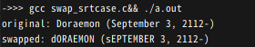
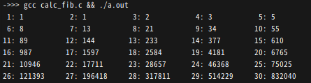
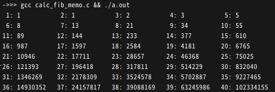

<!-- markdownlint-disable MD024 -->
# ソフトウェア工学 第4回 レポート課題

- 学生番号: 201811528
- 氏名: 春名航亨

## 【授業内課題の確認】

### 【授業内課題１：スコープ】

| コメ番号 | エラー |                                         理由                                          |
| :------: | :----: | :-----------------------------------------------------------------------------------: |
|    1     |   -    |  グローバル変数は、その同一プログラム内であれば関数やforブロック内であっても参照可能  |
|    2     |   -    |      関数内で宣言された変数は、同一関数内であればforブロック内であっても参照可能      |
|    3     |   -    | forブロック内で宣言された変数は、同一ブロック内であれば参照可能(下位ブロックでも可能) |
|    4     |   -    |  グローバル変数は、その同一プログラム内であれば関数やforブロック内であっても参照可能  |
|    5     |   -    |                 関数内で宣言された変数は、同一関数内であれば参照可能                  |
|    6     |   o    |                 ブロック内で宣言された変数はブロック外で参照できない                  |
|    7     |   -    |  グローバル変数は、その同一プログラム内であれば関数やforブロック内であっても参照可能  |
|    8     |   o    |                  別の関数内で宣言された変数は別関数内で参照できない                   |
|    9     |   o    |       別の関数内やその関数のブロック内で宣言された変数は別関数内で参照できない        |

### 【授業内課題２：文字列のオーバーラン】

```c
#include <stdio.h>

char* func_arr(){
  char ret_arr[] = "Hey! This is a local string in a function\n";
  return ret_arr;
}

int main(){
  printf("%s", func_arr());
}
```

>自分の環境と、上記のコードを実行したら何が起きたかを簡潔に述べてください

#### 環境

- OS: Ubuntu 21.10
- シェル: zsh 5.8 (x86_64-ubuntu-linux-gnu)
- コンパイラ: gcc (Ubuntu 11.2.0-7ubuntu2) 11.2.0

#### 起きたこと

- `(null)`と出力された。

### 【レポート課題１：破壊的な文字列操作】

>文字列を渡すと、その文字列に含まれている小文字を大文字に、大文字を小文字に書き換える、破壊的な関数を作ってください。
>メイン関数内では、書き換える前の文字列と、書き換え後の文字列をそれぞれprintfの%s指定子で表示してください。
>実行結果として、誰か好きな芸能人やキャラクターの氏名と、誕生日を繋げて書いてください。

#### ソースコード

```c
#include <stdio.h>

char _swap_case(char c) {
  if (64 < c && c < 91) {
    c += 32;
  } else if (96 < c && c < 123) {
    c -= 32;
  }
  return c;
}

void swap_case(char *arr) {
  int i = 0;
  while (arr[i] != '\0') arr[i++] = _swap_case(arr[i]);
}

void main() {
  char s[] = "Doraemon (September 3, 2112-)";
  printf("original: %s\n", s);
  swap_case(s);
  printf("swapped: %s\n", s);
}
```

#### 出力結果



### 【レポート課題２：フィボナッチ数列】

再帰計算を行う関数を使って、「n個めの数値は、n-1個めの数値と、n-2項めの数値を足したもの」という性質を持つ数列フィボナッチ数列の、任意のn項めの値を計算するプログラムを書いてください。
以下のソースコードを参考に、main関数から、1から29までのフィボナッチ数列を画面に表示してみましょう。

#### ソースコード

```c
#include <stdio.h>
int N = 30;

int calc_fib(int n) {
  return n < 2 ? n : calc_fib(n - 1) + calc_fib(n - 2);
}

void main() {
  int i = 0;
  for (; ++i <= N;)
    printf("%2d: %-10d%c", i, calc_fib(i), i % 5 ? ' ' : '\n');
}
```

#### 実行結果

Note: *29までだと見た目が悪かったので30まで出力しています*



### 【レポート課題３：メモ化を使った高速フィボナッチ数列】（発展課題）

>発展課題です。解ける人だけ解いてください。
>課題２で作成したフィボナッチ数列に、グローバル変数として計算済みの値を格納する、メモ化処理を施してください。そして、すぐに終わらない程度の大きな数で実行して、ストップウォッチ（WindowsのtimeitやLinuxのtimeコマンドでもよい）で実行時間を計測してください。メモ化した場合とそうでない場合でどのくらい実行速度に差が出たかを書いてください。

#### ソースコード

```c
#include <stdio.h>
int N = 30;
int memo[114514];

int calc_fib(int n) {
  if(memo[n] == 0)
    memo[n] = n < 2 ? n : calc_fib(n - 1) + calc_fib(n - 2);
  return memo[n];
}

void main() {
  int i = 0;
  for (; ++i <= N;)
    printf("%2d: %-10d%c", i, calc_fib(i), i % 5 ? ' ' : '\n');
}
```

#### 実行結果



#### 実行時間

30までだと両方とも一瞬だったので、45まで計算した。

```shellsession
$ time ({gcc calc_fib.c&&./a.out}&>2)
( { gcc calc_fib.c && ./a.out; } &> 2; )  27.22s user 0.00s system 99% cpu 27.224 total
$ time ({gcc calc_fib_memo.c&&./a.out}&>2)
( { gcc calc_fib_memo.c && ./a.out; } &> 2; )  0.05s user 0.02s system 99% cpu 0.068 total
```

| memo  | time(s) |
| :---: | :-----: |
| なし  | 27.224  |
| あり  |  0.068  |

### 【レポート課題４：面白かったり、役に立ったりする、オリジナルのコマンドを作る】

>何か実用性のあるコマンドラインプログラムか、ジョークアプリとして動作するコマンドラインプログラムを作ってみてください。

#### 概要

catコマンドがあるのに、popcatコマンドがないのは[Pop Cat](https://knowyourmeme.com/memes/pop-cat)好きにとって不憫だと思うので、Pop Catを端末上に表示するpopcatコマンドを作った。

Note: *おそらくGNU/Linuxでしか動作しません*

#### ソースコード

- `frame.c`

```c
char FRAME_01[][72] = {
    "                                                                       ",
    "                                                                       ",
    "                                                                       ",
    "                                              ;@f@                     ",
    "             @GGt@                          00    C                    ",
    "            ;     ;ff                     0f  888@                     ",
    "             CCLLC    Gf       @ff88@@@@@@  00888008f                  ",
    "          f LLLfffftt    ifiif;           iCC0000G00 0                 ",
    "          f ff1tffLLfttf       1fLG8@@@@@8CCC000GGG00;@                ",
    "          G Lf1ttffLLLfttt111tLG08@@@@@@@@@@8CffLCG00 8                ",
    "          @ GfttttttfLLt1tttfG88808@@@@@@@888GCLLGG00  0               ",
    "           f LLf111ttfLfffffLfi1tL8@@@80Cf111tC8@@@@80G G              ",
    "            f CGLttttttffftL008@@@@0L1;,..     .;tC888GC G             ",
    "             C G0GCf11tft11G8@880L1,              .;tLCCC i            ",
    "              C G00Cftfti;tG0GCL1,                  ,itLLC @           ",
    "              ;tGLt1t11;:1LCLLfi                     ,itLL 0           ",
    "                  i;:::.;tLLft:                      .;1fL 0           ",
    "                01 ;,,.,1fLfti                   .....:1fL             ",
    "                 ; ;:..:itfft1.  ...           .....,,i1Lf f           ",
    "                  t :, .;tffff1:,,,,.....   .....,,,:i1ffff0           ",
    "                   ; :,:1ffffffti;::,,,.......,,,::;i1ttt f            ",
    "                   C CftfffLLLLfft1i;;;:::,,::::;;111ttt t             ",
    "                  C CCCLLLLLLLLLffftt111iiiiiiii1111tff f              ",
    "                 C 00GLLLLLLLLLLfffffftttttt11111111ff f               ",
    "                0f00GCCLLLLLLLLfffffffttttt11111tttfLCfG               ",
    "                C 00CCCCCLLLLLLLLLffffttttttttttttffCC f               ",
    "               G G0GCCCCCLCCCLLLLLLLLLffftttttttttffCC 0               ",
    "             @  f00GCCCCCCCCLLLLLLLLLffffffffttttfffLC0                ",
    "           @@ ,@80GGGGCCCCCCLLLLLLLLLffffffffffffffLLCG 0              ",
    "          @  @@@8GGCCCCCCCCCCCLLLLLLLLfffffffffffffffCG C              ",
    "         @@8@@@@8GCCCCCCCCCCCCCCCLLLLLffLLfffffffffffCC G              ",
    "        ;@ 8@@@@8GCCCCCCCCCCCCCCCLLLLLfffffffffffffffCC C              ",
    "        @ 8@@@@80CCCCCCCCCCCCCCCCLLLLLLLLffffffffffffL0 @              ",
    "       0 8@@@@@80GGGGGGGGGGCCCCCCCCCCCCLLLLLLLLLLLLfLL ;               ",
    "       @ 8@@@8880CCCCCCCCCCCCCCCCCCCCLLLLLLLLLLffffffL;;               "};
char FRAME_02[][72] = {
    "                                                                       ",
    "                                                                       ",
    "                                                ;                      ",
    "                @f@                          @CC  0f                   ",
    "               f    fft                     G   8@  0                  ",
    "                0CC8    G0          ;@@   @i 0088000 f                 ",
    "             f LLffffff0  tftffftfG     @@  GG088000G@@                ",
    "             i ffttfLLfttf          @8G   1LLCG00GG00 C                ",
    "             t Lt1tfffLLftttfffttffLG8@@@@0CfLGGGCC00 0                ",
    "             G LLttttttfft11111tLG08@@@@@@@@880GCCC00 8                ",
    "              0 Lft1111fLfttftfC8@@@@@@@@@@@@0f11LC88 G                ",
    "               f CCt11tttfLftffL1:::,t8@@@@@@0:.,tG00@ G               ",
    "                C G0GLt11tttttLGCLftfL8@@@@@@@808@@8C1: ;              ",
    "                CfCG0Gftff11;;tG88@@@@@@@@0LffG@@@880Lft f             ",
    "                 f Cti1t11i,,;1LCCLLLCCCGGGLt1fft1tfffLf10;            ",
    "                  f 1;::::,.;1fLLfttt1t1111iiii;i1111tfff @            ",
    "                   f i:... .11tLLffffttttttt11t11tt11tfttf             ",
    "                    ; :,  .:iitLfffffftttttttttt11111ttt f             ",
    "                      ;,. .,:iffffffftttt111t1111111ttt t              ",
    "                     f t;..,itffffLfffttt111111111ttfL f               ",
    "                    0ffCLtttffffLLLffffttttt111ttttfLC@0               ",
    "                    C GGLLLLLLLfLffffftttttttttttttfLG f               ",
    "                   G G0CCLLLLLLfffffffttttttttttttffCC f               ",
    "                  8 GGCCCLLLLLLLLLffffffttttttttttffCC G               ",
    "                08 80GCCCCLLLLLLLLLLLfffftfffttttttfLCG ;              ",
    "               @@ 880CCCCCLLLLLLLLLLLfLLfffftttttttffCG C              ",
    "              @  880GGGCCCLLLLLLLLLLLLffffffffftttfffCC C              ",
    "             @ 0@@8GGCCCCCCCLLLLLLLLLffffffffffttffffCC t              ",
    "            @ 8@@@8GCCCCCCCCLCCLLLLLLffffffffffffffffLC8               ",
    "           f 0@@@88GCCCCCCCCCCCCLLLLLLfffffffffffffffLCG               ",
    "          @888@@@80CCCCCCCCCCCCLLLLLLLLffffffffttffffLL f              ",
    "          @ 8@@@880CCCCCCCCCCCCCCCCLLLLLfffffffffffffLL f              ",
    "         0 88@@888GCCCCCCCCLLCCCLLLLLLLLffffffffffffffL f              ",
    "         8 8@88888GGCCCCCCCCCCCCLLLLLLLLLLLLLffffffffLL f              ",
    "         @ 8888880CCCCCCCCCLLLLLLLLLfffffffffttttttttfL ;              "};
```

- `main.c`

```c
#include <getopt.h>
#include <stdio.h>
#include <stdlib.h>
#include <time.h>
#include <unistd.h>

#define RED 31
#define GREEN 32
#define YELLOW 33
#define BLUE 34
#define MAGENTA 35
#define CYAN 36
#define WHITE 37

extern char FRAME_01[][72];
extern char FRAME_02[][72];

int COLOR[] = {RED, GREEN, YELLOW, BLUE, MAGENTA, CYAN, WHITE};
int COLOR_NUM = sizeof(COLOR) / sizeof(int);

int PREV_COLOR = 0;

void print_help(char prog[]) {
  printf(
      "\
usage: %s [-f] [-t MS] [-h] [-v]\n\
\n\
*pop* *pop* *pop*\n\
\n\
optional arguments:\n\
  -f, --flip            flip cat\n\
  -t, --time <ms(>=0)>  interval of frames\n\
                        defaults to 200(ms)\n\
  -h, --help            display this help and exit\n\
  -v, --version         output version information and exit\n",
      prog);
  exit(0);
}

void print_version(void) {
  puts("popcat 0.0.1");
  exit(0);
}

void msleep(int sec) { usleep(sec * 1000); }

void clear_screen() { printf("\033[2J\033[3J\033[H"); }

int sample_color(void) {
  srand(time(NULL));
  return COLOR[rand() % COLOR_NUM];
}

void print_char_array(char char_arr[][72], int reverse) {
  int color = sample_color();
  if (reverse == 0) {
    for (int c = 0; c < 35; c++) {
      fflush(stdout);
      printf("\x1b[%dm%s\n", color, char_arr[c]);
    }
  } else {
    for (int c = 34; c >= 0; c--) {
      fflush(stdout);
      printf("\x1b[%dm%s\n", color, char_arr[c]);
    }
  }
}

int is_natural(char *s) {
  if (s[0] == '\0' || (s[0] == '0' && s[1] != '\0')) return 0;
  int i;
  while (s[i] != '\0')
    if ('0' > s[i] || '9' < s[i++]) return 0;
  return 1;
}

void print_frame(int sec, int reverse) {
  fflush(stdout);
  print_char_array(FRAME_01, reverse);
  msleep(sec);
  clear_screen();
  fflush(stdout);
  print_char_array(FRAME_02, reverse);
  msleep(sec);
  clear_screen();
}

int main(int argc, char *argv[]) {
  struct option longopts[] = {
      {"flip", no_argument, NULL, 'f'},
      {"help", no_argument, NULL, 'h'},
      {"version", no_argument, NULL, 'v'},
      {"time", required_argument, NULL, 't'},
      {0, 0, 0, 0},
  };
  int opt;
  int longindex;
  int flip = 0;
  int sleep_ms = 200;
  while ((opt = getopt_long(argc, argv, "fhvt:", longopts, &longindex)) != -1) {
    switch (opt) {
      case 'v':
        print_version();
        break;
      case 'h':
        print_help(argv[0]);
        break;
      case 'f':
        flip = 1;
        break;
      case 't':
        if (is_natural(optarg)) {
          sleep_ms = atoi(optarg);
        } else {
          fprintf(stderr, "%s: '%s' is not natural int. (0>=)\n", argv[0],
                  optarg);
          return 1;
        }
        break;
      case '?':
        return 1;
      default:
        fprintf(stderr, "%s: invalid option -- '%c'\n", argv[0], opt);
        return 1;
    }
  }
  clear_screen();
  while (1) {
    print_frame(sleep_ms, flip);
  }
}
```

#### 実行例

```shellsession
$ gcc frame.c main.c -o popcat
$ sudo install -m+x popcat /usr/local/bin
$ popcat -h
usage: popcat [-f] [-t MS] [-h] [-v]

*pop* *pop* *pop*

optional arguments:
  -f, --flip            flip cat
  -t, --time <ms(>=0)>  interval of frames
                        defaults to 200(ms)
  -h, --help            display this help and exit
  -v, --version         output version information and exit
$ popcat -v
popcat 0.0.1
```

#### 使い方

コマンドラインから`popcat`と入力する。すると、Pop CatのAAアニメが表示される。フレーム間隔を`-t`で指定可能。`-f`は逆さ表示。

### 【感想や要望】

CでCLIを書くのは面倒だとわかりました。
