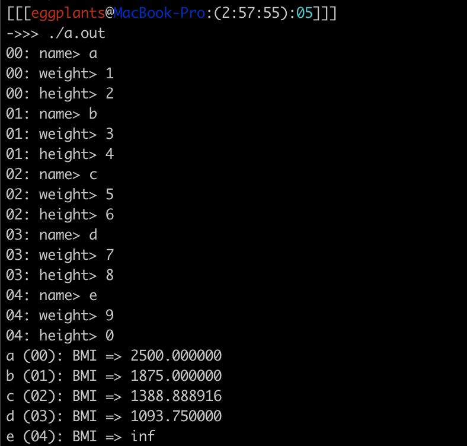
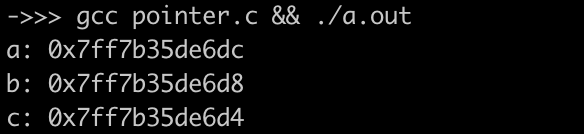
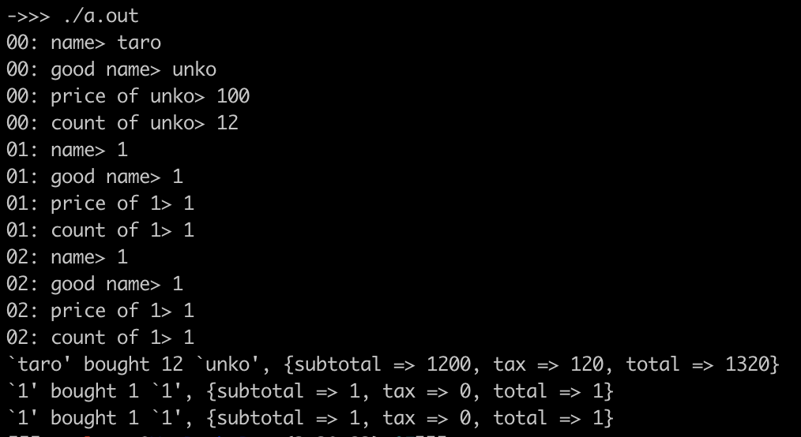
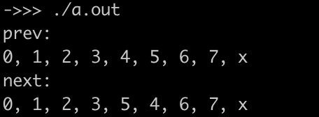

<!-- markdownlint-disable MD024 -->

# ソフトウェア工学 第5回 レポート課題

- 学生番号: 201811528
- 氏名: 春名航亨

## 【授業内課題１】構造体配列へのキーボード入力と、中身を使った計算

### (参考)ソースコード

```c
#include <stdio.h>

typedef struct person {
  char name[20];
  float weight;
  int height;
} Person;

float calc_bmi(Person p) {
  return p.weight / (p.height / 100.0 * p.height / 100.0);
}

int main() {
  Person p[5];
  int i;

  for (i = 0; i < 5;) {
    printf("%02d: name> ", i);
    scanf("%s", p[i].name);
    printf("%02d: weight> ", i);
    scanf("%f", &p[i].weight);
    printf("%02d: height> ", i);
    scanf("%d", &p[i++].height);
  }
  for (i = 0; i < 5;) {
    Person j = p[i];
    float bmi = calc_bmi(j);
    printf("%s (%02d): BMI => %f\n", j.name, i++, bmi);
  }
  return 0;
}
```

### スクリーンショット



## 【授業内課題２：変数のアドレス】

### (参考)ソースコード

```c
#include <stdio.h>

int main() {
  int a = 0;
  int b = 100;
  int c = 50;

  printf("a: %p\n", &a);
  printf("b: %p\n", &b);
  printf("c: %p\n", &c);
}
```

### スクリーンショット



## 【レポート課題１：構造体で購買履歴計算】

### ソースコード

```c
#include <stdio.h>

#define N 3
#define TAX 10

typedef struct purchase {
  char purchaser_name[20];
  char product_name[20];
  int price;
  int number;
} Purchase;

int calc_tax(int price, int tax) {
  return (int)(price / 100.0 * tax);
}

int main() {
  Purchase p[N];
  int i;

  for (i = 0; i < N;) {
    printf("%02d: name> ", i);
    scanf("%s", p[i].purchaser_name);
    printf("%02d: good name> ", i);
    scanf("%s", p[i].product_name);
    printf("%02d: price of %s> ", i, p[i].product_name);
    scanf("%d", &p[i].price);
    printf("%02d: count of %s> ", i, p[i].product_name);
    scanf("%d", &p[i++].number);
  }
  for (i = 0; i < N;) {
    Purchase j = p[i++];
    int subtotal = j.price * j.number;
    int tax = calc_tax(subtotal, TAX) ;
    printf(
      "`%s' bought %d `%s', ",
      j.purchaser_name, j.number, j.product_name
    );
    printf(
      "{subtotal => %d, tax => %d, total => %d}\n",
      subtotal, tax, subtotal + tax
    );
  }
  return 0;
}
```

### 実行画面



## 【レポート課題２】scanfの挙動を分析してみよう

>scanfが何を受け取って、どんな処理をしていて、何を返しているかを、だいたい150文字程度で簡潔に説明してください。

`scanf`は、入力の書式文字列と標準入力をパースした結果を破壊的に代入する対象となる変数のアドレスを引数に取る。そして関数内部でアドレスの中身をパース結果で上書きしている。また返り値として、正常にパースし代入された引数の変数の数を返す。例えば`scanf("%s", a))`なら1、`scanf("%s%s%s", a, b, c))`なら3が(正常な入力を与えた場合)返る。

## 【発展課題１】リストの要素を入れ替える関数を作る

>今回の授業で教わった内容である構造体と、構造体へのポインタを利用して、リストを作成してみてください。
>そして、リスト内の任意の2つのノードのアドレスを渡すと、値そのものは書き換えずにノード間のリンク関係だけを書き換えて破壊的に入れ替えを行う関数「`void swap(ListNode* a, ListNode* b)`」を実装してください。
>リストはサンプルコードのものでも、改良したものでも、自分でゼロから作っても構いません。
>サンプルを使った場合はswap関数の部分だけ、そうでない場合はプログラム全体を貼ってください。

### ソースコード

```c
#include <stdio.h>
#include <stdlib.h>

typedef struct listnode {
  struct listnode *next;
  struct listnode *prev;
  int data;
} ListNode;

ListNode listnodes[8];

int data[] = {0, 1, 2, 3, 4, 5, 6, 7};

void show_list(ListNode **node) {
  ListNode *n = &node[0];
  while (n != NULL) {
    printf("%d, ", n->data);
    n = n->next;
  }
  puts("x");
}

void swap(ListNode *a, ListNode *b) {
  if (a == b) return;
  if (b->next == a) {
    ListNode tmp = *a;
    *a = *b;
    *b = tmp;
  }
  ListNode *w = a->prev;
  ListNode *x = a->next;
  ListNode *y = b->prev;
  ListNode *z = b->next;
  if ((a->next == b && b->prev == a) || (a->prev == b && b->next == a)) {
    a->prev = x;
    a->next = z;
    b->prev = w;
    b->next = y;
  } else {
    a->prev = y;
    a->next = z;
    b->prev = w;
    b->next = x;
  }
  if (a->prev != NULL) {
    a->prev->next = a;
  }
  if (a->next != NULL) {
    a->next->prev = a;
  }
  if (b->prev != NULL) {
    b->prev->next = b;
  }
  if (b->next != NULL) {
    b->next->prev = b;
  }
}

int main() {
  int n = sizeof(listnodes) / sizeof(ListNode);
  for (int i = 0; i < n; i++) {
    listnodes[i].data = data[i];
    if (i == 0) {
      listnodes[i].prev = NULL;
    } else {
      listnodes[i].prev = &listnodes[i - 1];
      listnodes[i - 1].next = &listnodes[i];
    }
    listnodes[i].next = NULL;
  }
  puts("prev:");
  show_list(&listnodes);
  swap(&listnodes[4], &listnodes[5]);
  puts("next:");
  show_list(&listnodes);
}
```

### スクリーンショット



## 【発展課題２】リストの要素を破壊的に並び替えるソート関数を作る

>発展課題１で作成したswap関数を用いて、data1の値からリストを破壊的に並び替えるソート関数を実装してみてください。
>一番簡単なのはバブルソートですが、自分の好きなソートアルゴリズムで実装して大丈夫です。
>ソートを実際に行う関数のソースコードと、実行結果のスクリーンショットを貼ってください。

実装できず

## 【感想や要望】

敗北しました。。。
