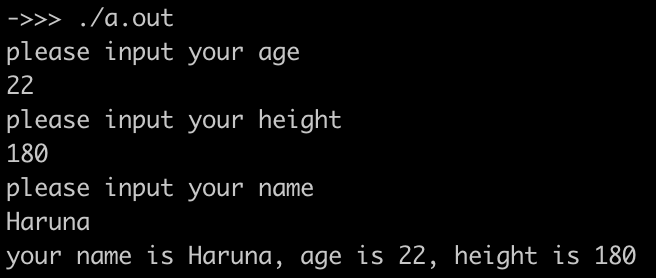
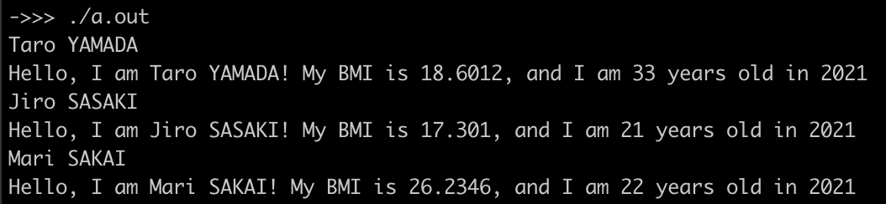
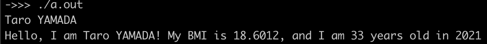
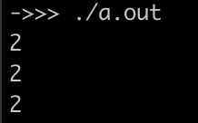

<!-- markdownlint-disable MD024 -->
# ソフトウェア工学 第6回 レポート課題

- 学生番号: 201811528
- 氏名: 春名航亨

## 【授業内課題の確認】

### 【授業内課題１：c++が動いているかの確認】

#### ソースコード

```cpp
#include <iostream>
#include <string>

using namespace std;

int main(){
  int age;
  cout << "please input your age" << endl;
  cin >> age;

  float height;
  cout << "please input your height" << endl;
  cin >> height;

  string name;
  cout << "please input your name" << endl;
  cin >> name;

  cout << "your name is " << name << ", age is " << age << ", height is " << height << endl;
  return 0;
}
```

#### 実行結果



### 【授業課題２：メンバとメソッドの追加】

>作製したPersonクラスに、メンバ変数とメソッドを足してみてください。

#### ソースコード

```cpp
#include <stdio.h>
#include <iostream>
#include <string>

using namespace std;

class Person{
  public:
    // member
    string name;
    int height, birth_year;
    float weight, bmi;

    // constructor
    Person(string name, int h, float w, int birth_year);

    // method
    void show_name();
    void self_introduce(int current_year);
};

Person::Person(string n, int h, float w, int y) {
  name = n;
  height = h;
  weight = w;
  birth_year = y;
  bmi = weight / ((height / 100.0) * (height / 100.0));
}

void Person::show_name(){
  cout << name << endl;
};

void Person::self_introduce(int current_year){
  cout << "Hello, I am " << name << "! My BMI is " << bmi << ", ";
  cout << "and I am " << current_year - birth_year << " years old in " << current_year << endl;
};

int main(){
  int current_year = 2021;
  Person taro("Taro YAMADA", 168, 52.5, 1988);
  taro.show_name();
  taro.self_introduce(current_year);
  Person jiro("Jiro SASAKI", 170, 50.0, 2000);
  jiro.show_name();
  jiro.self_introduce(current_year);
  Person mari("Mari SAKAI", 180, 85.0, 1999);
  mari.show_name();
  mari.self_introduce(current_year);
  return 0;
}
```

#### 実行結果



### 【授業課題３：private化】

#### ソースコード

```cpp
#include <stdio.h>
#include <iostream>
#include <string>

using namespace std;

class Person{
  public:
    // member
    string name;
    int height;
    float weight, bmi;

    // constructor
    Person(string name, int h, float w, int birth_year);

    // method
    int get_birth_year();
    void show_name();
    void self_introduce(int current_year);

  private:
    int birth_year;
};

Person::Person(string n, int h, float w, int y) {
  name = n;
  height = h;
  weight = w;
  birth_year = y;
  bmi = weight / ((height / 100.0) * (height / 100.0));
}

int Person::get_birth_year(){
  return birth_year;
}

void Person::show_name(){
  cout << name << endl;
};

void Person::self_introduce(int current_year){
  cout << "Hello, I am " << name << "! My BMI is " << bmi << ", ";
  cout << "and I am " << current_year - birth_year << " years old in " << current_year << endl;
};

int main(){
  int current_year = 2021;
  Person taro("Taro YAMADA", 168, 52.5, 1988);
  taro.show_name();
  taro.self_introduce(current_year);
  return 0;
}
```

#### 実行結果



## 【レポート課題】

### 【レポート課題１：調べもの】

>C++以外のオブジェクト指向言語の例を3つ調べ、それぞれどのくらいよく使われているかを一言で書いてください
>（利用者人数が何人だとか、Googleのプロダクトの何割がこの言語で書かれているとか、iOS開発はこの言語じゃないとできないとか）。

1. Javascript - GitHubの17.955%
2. Python - GitHubの15.943%
3. Ruby - GitHubの6.488%

参考: *GitHut 2.0, 2021年Q3時点 (<https://madnight.github.io/githut/#/pull_requests/2021/3>)*

### 【レポート課題２：最小限に実用的なクラス「Vector」を作る】

>ベクトルデータを扱うためのクラス「Vector」を作成してみてください。

#### ソースコード

```cpp
#include <cmath>
#include <iostream>

using namespace std;

class Vector{
  public:
    float x, y;
    Vector(float x_, float y_);
    float manhattan();
};

Vector::Vector(float x_, float y_){
  x = x_;
  y = y_;
};

float Vector::manhattan(){
  return abs(x) + abs(y);
};

int main(){
  Vector v1(1.5, 0.5), v2(-1.5, 0.5), v3(-1.5, -0.5);
  cout << v1.manhattan() << endl;
  cout << v2.manhattan() << endl;
  cout << v3.manhattan() << endl;
  return 0;
}
```

#### 実行結果



### 【発展課題：Vectorクラスを少し実用化してみる】

>レポート課題２で作成したVectorクラスに、実際のベクトル計算で使えるメソッドを好きなように追加して、そのコードと説明を書いてください。

```cpp
#include <cmath>
#include <iostream>

using namespace std;

class Vector {
 public:
  float x, y;
  Vector(float x_, float y_);

  void print();
  float manhattan();
  float manhattan(Vector v);
  float euclidean();
  float euclidean(Vector v);
  float inner_product(Vector v);
  float outer_product(Vector v);
  Vector add(Vector v);
  Vector sub(Vector v);
  Vector reverse();
  Vector normalize();
};

// constructor
Vector::Vector(float x_, float y_) {
  x = x_;
  y = y_;
}

void Vector::print() { cout << "x: " << x << ", y: " << y << endl; }

// マンハッタン距離
// - 原点との
float Vector::manhattan() { return abs(x) + abs(y); };
// - 引数にとったベクトルとの
float Vector::manhattan(Vector v) { return abs(x - v.x) + abs(y - v.y); };

// ユークリッド距離
// - 原点との
float Vector::euclidean() { return sqrt(x * x + y * y); };
// - 引数にとったベクトルとの
float Vector::euclidean(Vector v) {
  return sqrt(pow(x - v.x, 2.0) + pow(y - v.y, 2.0));
};

// 引数にとったベクトルとの内積(ドット積)
float Vector::inner_product(Vector v) { return x * v.x + y * v.y; };
// 引数にとったベクトルとの外積(クロス積)
float Vector::outer_product(Vector v) { return x * v.y - y * v.x; };

// 引数にとったベクトルとの加法
Vector Vector::add(Vector v) {
  Vector r(x + v.x, y + v.y);
  return r;
};
// 引数にとったベクトルとの減法
Vector Vector::sub(Vector v) {
  Vector r(x - v.x, y - v.y);
  return r;
};

// 逆ベクトル
Vector Vector::reverse() {
  Vector r(-x, -y);
  return r;
};

// 正規化
Vector Vector::normalize() {
  float norm = Vector::euclidean();
  Vector r(x / norm, y / norm);
  return r;
};
```

## 【感想や要望】

前回の発展課題の参考実装が欲しいです。
