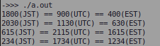

# ソフトウェア工学 第7回 レポート課題

- 学生番号: 201811528
- 氏名: 春名航亨

## 【レポート課題１：オーバーロード＋ゲッタとセッタ】

### ソースコード

```cpp
#include <cmath>
#include <iostream>
#include <stdexcept>

using namespace std;

class Time {
 private:
  int hour;
  int minute;
  void set_time(int hm, int diff);
  void set_time(int h, int m, int diff);
  int get_time(int diff);

 public:
  // 内部的にはutcで管理
  void set_utc(int hm);
  void set_utc(int h, int m);
  void set_jst(int hm);
  void set_jst(int h, int m);
  void set_est(int hm);
  void set_est(int h, int m);
  int get_utc();
  int get_jst();
  int get_est();
};

void Time::set_time(int hm, int diff) {
  if (not(100 <= hm <= 2459)) {
    throw std::invalid_argument("error: should be 100 <= time <= 2459");
  } else if (59 < hm % 100) {
    throw std::invalid_argument("error: should be 00 <= minute <= 59");
  } else {
    int h = floor(hm / 100) - diff;
    h = h < 0 ? h + 24 : h > 23 ? h - 24 : h;
    hour = h == 24 ? 0 : h;
    minute = hm % 100;
  }
};

void Time::set_time(int h, int m, int diff) {
  if (not(0 <= h <= 23)) {
    throw std::invalid_argument("error: should be 0 <= hour <= 23");
  } else if (not(0 <= m <= 59)) {
    throw std::invalid_argument("error: should be 0 <= minute <= 59");
  } else {
    h -= diff;
    hour = h < 0 ? h + 24 : h > 23 ? h - 24 : h;
    minute = m;
  }
};

int Time::get_time(int diff) {
  if (not(0 <= hour <= 24)) {
    throw std::invalid_argument("error: should be 0 <= hour <= 23");
  } else if (not(0 <= minute <= 59)) {
    throw std::invalid_argument("error: should be 0 <= minute <= 59");
  } else {
    int h = hour + diff;
    h = h < 0 ? h + 24 : h > 23 ? h - 24 : h;
    return 100 * h + minute;
  }
};

void Time::set_utc(int hm) { set_time(hm, 0); };
void Time::set_utc(int h, int m) { set_time(h, m, 0); };
void Time::set_jst(int hm) { set_time(hm, 9); };
void Time::set_jst(int h, int m) { set_time(h, m, 9); };
void Time::set_est(int hm) { set_time(hm, -5); };
void Time::set_est(int h, int m) { set_time(h, m, -5); };
int Time::get_utc() { return get_time(0); };
int Time::get_jst() { return get_time(9); };
int Time::get_est() { return get_time(-5); };

void test(Time *t) {
  cout << t->get_jst() << "(JST) == ";
  cout << t->get_utc() << "(UTC) == ";
  cout << t->get_est() << "(EST)" << endl;
}

int main() {
  Time t1, t2, t3, t4;
  t1.set_jst(1800);
  test(&t1);
  t2.set_utc(11, 30);
  test(&t2);
  t3.set_jst(6, 15);
  test(&t3);
  t4.set_est(1234);
  test(&t4);
}
```

### 実行結果



## 【レポート課題２：調べもの】

### RubyやPythonでオーバーロードが一般的でないその理由

RubyやPythonは動的型付けのため、引数の型を強制する機能はない。Ruby3やPython3.5~では型注釈を使って関数や変数に型を指定できるが強制力を持たない。むしろそのように型の存在をできるだけ気にせずにプログラミング出来ることが思想にあるため、オーバーロードが一般的で無いと言える。(147文字)

### RubyやPythonでオーバーロードを無理やり実現したり、代わりになる機能

#### Ruby(>=3.0.0)

メソッドに対して異なる引数の数・型のメソッドをオーバーロードするためのライブラリ[pocke/overloader](https://github.com/pocke/overloader)を以下のように用いる。

```ruby
# frozen_string_literal: true

# rbenv install 3.0.2
# rbenv global 3.0.2
# gem install overloader
require 'overloader'
require 'overloader/type'

# Good class
class Good
  extend Overloader
  overload do
    # () -> untyped
    def good() = { name: nil, price: nil }
    # (String) -> untyped
    def good(name) = { name: name, price: nil }
    # (Integer) -> untyped
    def good(price) = { name: nil, price: price }
    # (String, Integer) -> untyped
    def good(name, price) = { name: name, price: price }
    # (Integer, String) -> untyped
    def good(price, name) = { name: name, price: price }
  end
end

g = Good.new
p g.good # => {:name => nil, :price => nil}
p a.good('choco') # => {:name => "choco", :price => nil}
p a.good(100) # => {:name => nil, :price => 100}
p a.good('choco', 100) # => {:name => "choco", :price => 100}
p a.good(100, 'choco') # => {:name => "choco", :price => 100}
```

#### Python(>=3.10.0b2)

(型注釈レベルでのオーバーロードは)`@typing.overload`デコレータを以下のように用いる。

```python
# pyenv install 3.11.0a2
# pyenv local 3.11.0a2
from typing import TypeVar, overload

T = TypeVar("T")


@overload
def print_number(n: int) -> None: ...

@overload
def print_number(n: float) -> None: ...

@overload
def print_number(n: object) -> None: ...

def print_number(n):
    if isinstance(n, int):
        print(f"{n} (int)")
    elif isinstance(n, float):
        print(f"{n} (float)")
    elif isinstance(n, object):
        print(f"{n} (not number)")


print_number(100) # => 100 (int)
print_number(1.5) # => 1.5 (float)
print_number("Hello!") # => Hello! (not number)
```

## 【感想や要望】

特にありません。
