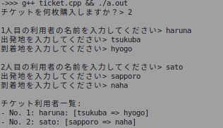

<!-- markdownlint-disable MD024 -->
# ソフトウェア工学 第8回 レポート課題

- 学生番号: 201811528
- 氏名: 春名航亨

## レポート課題１：サブクラスの追加と、オーバーライドの練習

> 作成したAnimalを継承するサブクラス群に、自分で考えた、以下の3つのものを追加してみてください。
> １．「人」「犬」「魚」以外の、何か個性的な動物を、Animalのサブクラスとして定義してください。
> ２．「動物であれば、どんな動物でも持っている普遍的な機能」を、Animalクラスのメソッドとして追加してください。
> ３．１で定義した動物について、２で定義したメソッドをオーバーライドして、その動物の個性が分かるような動作にしてください。「人」「犬」についても、サブクラスごとに動作を変えた方がいい場合には、メソッドをオーバーライドして動作を上書き定義してください。

### ソースコード

```cpp
#include <stdio.h>

#include <iostream>
#include <string>

using namespace std;

class Animal {
 protected:
  string name;
  int height;
  int weight;
  float calc_demand_oxygen(int air_volume);

 public:
  Animal(string _name, int _height, int _weight);
  void breath(int air_volume);
  void sleep();
  void make_sound();
};

Animal::Animal(string _name, int _height, int _weight) {
  name = _name;
  height = _height;
  weight = _weight;
}

float Animal::calc_demand_oxygen(int air_volume) {
  return air_volume * 0.1 * weight;
}

void Animal::breath(int air_volume) {
  cout << name << " took in " << Animal::calc_demand_oxygen(air_volume)
       << " cc of oxygen." << endl;
}

void Animal::sleep() { cout << "zzz..." << endl; }

void Animal::make_sound() { cout << "..." << endl; }

class Cat : public Animal {
 public:
  void sleep();
  void make_sound();
  Cat(string _name, int _height, int _weight)
      : Animal(_name, _height, _weight){};
};

void Cat::sleep() {
  cout << "　　　　　 ＿＿"
       << "　　　　／＞　　フ"
       << "　　　　|  _　 _ l"
       << " 　　　／` ミ＿xノ"
       << "　 　 /　　　 　 |"
       << "　　 /　 ヽ　　 ﾉ"
       << " 　 │　　|　|　|"
       << "／￣|　　 |　|　|"
       << "| (￣ヽ＿_ヽ_)__)"
       << "＼二つ" << endl;
}

void Cat::make_sound() { cout << "*Meow* *Meow*" << endl; }

class Dog : public Animal {
 public:
  void sleep();
  void make_sound();
  Dog(string _name, int _height, int _weight)
      : Animal(_name, _height, _weight){};
};

void Dog::sleep() {
  cout << "　＜⌒／ヽ＿＿"
       << "／＜_/＿＿＿／"
       << "￣￣￣￣￣￣" << endl;
}

void Dog::make_sound() { cout << "Bow!! Bow!!" << endl; }

class Fish : public Animal {
 public:
  Fish(string _name, int _height, int _weight)
      : Animal(_name, _height, _weight){};
};

class Human : public Animal {
 public:
  string job;
  void sleep();
  void make_sound();
  void self_introduction();
  Human(string _name, int _height, int _weight, string _job)
      : Animal(_name, _height, _weight) {
    job = _job;
  }
};

void Human::sleep() { cout << "😴" << endl; }

void Human::make_sound() { Human::self_introduction(); }

void Human::self_introduction() {
  cout << "Hi! I'm " << Human::name << "! I'm " << Human::weight
       << "kg! my job is " << Human::job << "." << endl;
}
```

## 授業課題１（去年の課題）チケット一覧表示システムを作る

### スクリーンショット



## 授業課題２（去年の課題）自分で継承してみる

### ソースコード

```cpp
#include <iostream>

using namespace std;

class Person {
 public:
  string name;
};

class Ticket {
 public:
  int id;
  Person* user;
  Ticket() { user = new Person; }
};

class TransTicket : public Ticket {
 public:
  string origin;
  string destination;
  TransTicket() : Ticket(){};
};

class PlaneTicket : public TransTicket {
 public:
  PlaneTicket() : TransTicket(){};
};

int main() {
  int ticketNum;
  cout << "チケットを何枚購入しますか？> ";
  cin >> ticketNum;
  cout << endl;
  TransTicket* tickets = new TransTicket[ticketNum];
  for (int i = 0; i < ticketNum; i++) {
    tickets[i].id = i + 1;
    cout << i + 1 << "人目の利用者の名前を入力してください> ";
    cin >> tickets[i].user->name;
    cout << "出発地を入力してください> ";
    cin >> tickets[i].origin;
    cout << "到着地を入力してください> ";
    cin >> tickets[i].destination;
    cout << endl;
  }
  cout << "チケット利用者一覧:" << endl;
  for (int i = 0; i < ticketNum; i++) {
    TransTicket t = tickets[i];
    cout << "- No. " << t.id << ": " << t.user->name << ": [" << t.origin
         << " => " << t.destination << "]" << endl;
  }
  return 0;
}
```

## レポート課題２：上記のプログラムに「時刻」の機能を追加する

### ソースコード

```c++
#include <iomanip>
#include <iostream>
#include <sstream>

using namespace std;

class Person {
 public:
  string name;
};

class Clock {
 public:
  int hour;
  int minute;
};

class Ticket {
 public:
  int id;
  Person* user;
  Ticket() { user = new Person; }
};

class TransTicket : public Ticket {
 public:
  string origin;
  string destination;
  TransTicket() : Ticket(){};
};

class PlaneTicket : public TransTicket {
 public:
  Clock* departureTime;
  Clock* arrivalTime;
  PlaneTicket() : TransTicket() {
    departureTime = new Clock();
    arrivalTime = new Clock();
  };
};

void set_time_from_stdin(Clock* p) {
  string s;
  cin >> s;
  istringstream f;
  f.str(s);
  char delim;
  f >> p->hour >> delim >> p->minute;
}

int main() {
  int ticketNum;
  cout << "チケットを何枚購入しますか？> ";
  cin >> ticketNum;
  cout << endl;
  PlaneTicket* tickets = new PlaneTicket[ticketNum];
  for (int i = 0; i < ticketNum; i++) {
    tickets[i].id = i + 1;
    cout << i + 1 << "人目の利用者の名前を入力してください> ";
    cin >> tickets[i].user->name;
    cout << "出発地を入力してください> ";
    cin >> tickets[i].origin;
    cout << "出発時刻を入力してください(hh:mm)> ";
    set_time_from_stdin(tickets[i].departureTime);
    cout << "到着地を入力してください> ";
    cin >> tickets[i].destination;
    cout << "到着時刻を入力してください(hh:mm)> ";
    set_time_from_stdin(tickets[i].arrivalTime);
    cout << endl;
  }
  cout << "チケット利用者一覧:" << endl;
  for (int i = 0; i < ticketNum; i++) {
    PlaneTicket t = tickets[i];
    cout << "- No. " << t.id << ": " << t.user->name;
    cout << ": [" << t.origin;
    cout << "<" << setw(2) << setfill('0') << t.departureTime->hour << ":"
         << setw(2) << setfill('0') << t.departureTime->minute;
    cout << "> => " << t.destination;
    cout << "<" << setw(2) << setfill('0') << t.arrivalTime->hour << ":"
         << setw(2) << setfill('0') << t.arrivalTime->minute;
    cout << ">]" << endl;
  }
  return 0;
}
```

### スクリーンショット


## 【感想や要望】

特にありません。
