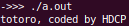

<!-- markdownlint-disable MD024 -->
# ソフトウェア工学 第8回 レポート課題

- 学生番号: 201811528
- 氏名: 春名航亨

## レポート課題１

> 「車(Car)」「スポーツカー(SportsCar)」という抽象クラスと、「GTR」「RX7」という普通のクラスを作ってください。

### ソースコード

```cpp
#include <iostream>
using namespace std;

class Car {
 protected:
  string owner;

 public:
  Car(){};
  void setOwner(string _owner) { owner = _owner; }
  virtual void run() = 0;
};

class SportsCar : public Car {
 protected:
  string boost_pressure;

 public:
  SportsCar(){};
  void set_boost_pressure(int _pressure) { boost_pressure = _pressure; }
};

class GTR : public SportsCar {
 public:
  void run() {
    cout << owner << "'s GTR ran at 120km/h on pressure " << boost_pressure
         << endl;
  };
};

class RX7 : public SportsCar {
 public:
  void run() {
    cout << owner << "'s RX7 ran at 130km/h on pressure " << boost_pressure
         << endl;
  };
};
```

## レポート課題２

> stringクラスのフィールドtitleを持たせたmovie（映画）クラス、stringクラスのフィールドcode（コード）を持たせたcopyprotection（コピー保護）クラスを作成せよ。
> それらをいずれも継承したprotectedMovie（コピー保護された映画）クラスを作成せよ。
> protectedMovieクラスのインスタンスがtitleとcodeの両方を持つことをmain関数において利用することで示せ

### ソースコード

```cpp
#include <iostream>
using namespace std;

class Movie {
 public:
  string title;
  Movie(string _title) { title = _title; }
};

class CopyProtection {
 public:
  string code;
  CopyProtection(string _code) { code = _code; }
};

class ProtectedMovie : public Movie, public CopyProtection {
 public:
  ProtectedMovie(string _title, string _code)
      : Movie(_title), CopyProtection(_code){};
};

int main() {
  ProtectedMovie Totoro = ProtectedMovie("totoro", "HDCP");
  cout << Totoro.title << ", coded by " << Totoro.code << endl;
};
```

### スクリーンショット



## レポート課題３

>今回学んだ抽象クラスや継承などを使うと、実際のソフトウェア開発でよく使われる、お決まりの設計をいろいろ実装できるようになります。ソフトウェア工学分野において、このような、普遍的に頻繁に使われる設計のことを「デザインパターン」と呼びます。
>別に配布した昨年まで使われていた資料の、オブジェクト指向に関するフレームワークとデザインパターンに関する資料をよく読んで、以下の問いに答えてください。
>資料に出てきていないデザインパターンを1つ調べてみて、そのデザインパターンの概要を100文字前後で書いてください。そして、どのような処理を実装したいときに使うかを一言で書いてください。

- シングルトン(Singleton)

アプリケーション内で、あるクラスのすべてのインスタンスがただ一つのオブジェクトを共有するようにするパターン。
普通のグローバル変数と違って、ただ一つしか存在しないことを(たとえマルチスレッドの場合でも)保証できる。

```cpp
class GlobalHoge{
public:
   static GlobalHoge* Instance(); // インスタンス生成
   static Singleton *GetInstance(){return s_pInstance;} // ゲッタ

protected:
   GlobalHoge(); // コンストラクタをprotected宣言
   static GlobalHoge* _Instance; // 共有するオブジェクトのポインタ
}
GlobalHoge* GlobalHoge::Instance(){
   if(!_Instance) // == NULL:
      _Instance = new GlobalHoge;

   return _Instance;
}
...
// グローバル変数として
GlobalHoge* GlobalHoge::_Instance = NULL; // Null pointer
GlobalHoge::Instance(); // Init
...
// 常に同じインスタンスへのポインタが返る
GlobalHoge* GH = GlobalHoge::Instance();
```

## 【感想や要望】

特にありません。
