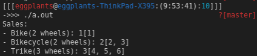

<!-- markdownlint-disable MD024 -->
# ソフトウェア工学 第10回 レポート課題

- 学生番号: 201811528
- 氏名: 春名航亨

## 【授業内課題1】

> 上記のコードを実行して、関数の実行前と後でaの値がどうなったかを確認してください。
> そして、これを、引数名の頭の「&」を取って通常の価渡しにした場合と、挙動を比較してみてください。

- 参照渡し

```cpp
#include <iostream>

using namespace std;

void func(int &x) { x += 1; }

int main() {
  int a = 1;
  cout << "before: a=" << a << endl;  // "before: a=1"
  func(a);
  cout << "after:  a=" << a << endl;  // "after:  a=2"
}
```

- 値渡し

```cpp
#include <iostream>
using namespace std;

void func(int x) { x += 1; }

int main() {
  int a = 1;
  cout << "before: a=" << a << endl;  // "before: a=1"
  func(a);
  cout << "after:  a=" << a << endl;  // "after:  a=1"
}
```

## 【おまけレポート課題１】

>1行に1つの数値が書かれたテキストファイル「data.txt」を読み込み、その平均を「output.txt」というファイルに出力するプログラムを書いてください。

### ソースコード

```c++
#include <filesystem>
#include <fstream>
#include <iostream>
#include <string>

using namespace std;

bool is_number(const string& s) {
  string::const_iterator it = s.begin();
  while (it != s.end() && isdigit(*it)) ++it;
  return !s.empty() && it == s.end();
}

int main(int argc, char* argv[]) {
  if (argc == 1) {
    cout << "usage: " << argv[0] << " <numfile> <outfile>" << endl;
    return 0;
  } else if (argc != 3) {
    cerr << "usage: " << argv[0] << " <numfile> <outfile>" << endl;
    cerr << "numfile must be a file with only one int number per line." << endl;
    return 1;
  }
  string iname = argv[1];
  string oname = argv[2];
  if (!filesystem::exists(iname)) {
    cerr << "err: file not found: " << iname << endl;
    return 1;
  }
  if (filesystem::exists(oname)) {
    cerr << "err: outfile exists: " << oname << endl;
    return 1;
  }

  ifstream fi(iname);
  int ln = 0;
  int sum = 0;
  string s;

  while (getline(fi, s)) {
    ln++;
    if (is_number(s)) {
      cerr << "err: invalid line " << ln << endl;
      cerr << "numfile must be a file with only one int number per line."
           << endl;
      fi.close();
      return 1;
    } else {
      sum += stoi(s);
    }
  }
  fi.close();
  ofstream fo(oname);
  float avg = (float)sum / (float)ln;
  fo << avg << endl;
  fo.close();
  cout << "output: " << oname << endl;
  return 0;
}
```

### スクリーンショット


## 【おまけレポート課題２】

>ソースコードを拡張して、自動車やトライク（オート三輪）についても扱えるようにしてください。

### ソースコード

```cpp
#include <iostream>
#include <sstream>
#include <stdexcept>
#include <typeinfo>

using namespace std;

class Vehicle {
 public:
  virtual void set_number(int n) { number = n; };

 private:
  int number;
  static const int num_wheels;
};

class Bike : public Vehicle {
 public:
  static const int num_wheels = 2;
  static int num_sold;
  static const int num_remain = 3;
  static int register_numbers[num_remain];
  Bike(int n) {
    if (num_remain == num_sold) {
      throw overflow_error("not remain");
    }
    set_number(n);
    register_numbers[num_sold] = n;
    num_sold++;
  }
};
int Bike::num_sold = 0;
int Bike::register_numbers[];

class Bikecycle : public Vehicle {
 public:
  static const int num_wheels = 2;
  static int num_sold;
  static const int num_remain = 3;
  static int register_numbers[num_remain];
  Bikecycle(int n) {
    if (num_remain == num_sold) {
      throw overflow_error("not remain");
    }
    set_number(n);
    register_numbers[num_sold] = n;
    num_sold++;
  }
};
int Bikecycle::num_sold = 0;
int Bikecycle::register_numbers[];

class Trike : public Vehicle {
 public:
  static const int num_wheels = 3;
  static int num_sold;
  static const int num_remain = 3;
  static int register_numbers[num_remain];
  Trike(int n) {
    if (num_remain == num_sold) {
      throw overflow_error("not remain");
    }
    set_number(n);
    register_numbers[num_sold] = n;
    num_sold++;
  }
};
int Trike::num_sold = 0;
int Trike::register_numbers[];

string itos(int a) {
  stringstream ss;
  ss << a;
  return ss.str();
}

string iatos(int is[], int length) {
  string s = "[";
  for (int i = 0; i < length; i++) {
    if (is[i] == 0) {
      s += "-";
    } else {
      s += itos(is[i]);
    }
    if (i != length - 1) s += ", ";
  }
  s += "]";
  return s;
}

string rmnum(string s) {
  for (int i = 0; i < s.length(); i++) {
    if (isdigit(s[i])) {
      s.erase(i, 1);
      i--;
    }
  }

  return s;
}

template <typename T>
void test(T x) {
  cout << "- " << rmnum(typeid(x).name()) << "(" << T::num_wheels
       << " wheels): " << T::num_sold << ""
       << iatos(T::register_numbers, T::num_sold) << endl;
}

int main() {
  cout << "Sales:" << endl;
  test(Bike(1));
  Bikecycle(2);
  test(Bikecycle(3));
  Trike(4), Trike(5);
  test(Trike(6));
  // Trike(7);  // -> std::overflow_error: not remain
}
```

### スクリーンショット



## 【おまけレポート課題３】

>ひどい「person」クラスのコードを、なるべくSOLID原則に従う形で、クラス設計しなおしてください。この際、「sommelier（ソムリエ）」を追加してください。

### ソースコード

```cpp
#include <iostream>
using namespace std;

class Person {
 protected:
  string name;

 public:
  string getName() { return name; }
  string setName(string n) { name = n; }
  Person(string n) { name = n; };
  virtual void introduction() {}
};

class Customer : public Person {
 public:
  Customer(string n) : Person(n) {}
  void introduction() { cout << "I'm" << name << ". I'm a guest" << endl; }
};

class Shef : public Person {
 public:
  string getFeature() { return feature; }
  string getGrade() { return grade; }
  void setFeature(string d) { feature = d; };
  void setGrade(string g) { grade = g; };
  void introduction() {
    string dish = getFeature();
    if (dish != "") {
      cout << "Today's featured dish is " << dish << "." << endl;
    } else {
      cout << "There is no featured dish today. Sorry!" << endl;
    }
  }
  Shef(string n, string g) : Person(n) { grade = g; }

 protected:
  string feature;
  string grade;
};

class Manager : public Person {
 public:
  Manager(string n) : Person(n) {}
  void introduction() { cout << "I am a manager!" << endl; }
};

class Staff : public Person {
 public:
  Staff(string n) : Person(n) {}
  void introduction() { cout << "Hello, may I help you?" << endl; }
};

class Sommelier : public Person {
 public:
  Sommelier(string n) : Person(n) {}
  void introduction() { cout << "I am a sommelier!" << endl; }
};
```

## 【感想や要望】

特にありません。
